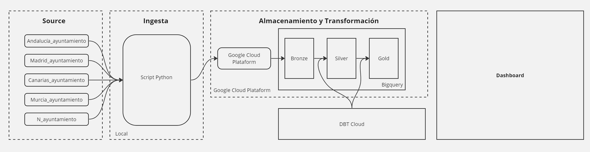

# Análisis de Ocupación Turística en España

## Descripción del proyecto

### Contexto

El sector turístico es uno de los pilares de la economía española. Conocer la evolución de la ocupación turística en las diferentes comunidades autónomas a lo largo del tiempo permite a las autoridades y empresas tomar decisiones estratégicas para impulsar el turismo en las diferentes regiones del país.

### Objetivo

Fortalecer las habilidades en ingeniería de datos mediante el análisis de datos de ocupación turística en España, utilizando la metodología ELT (Extracción, Carga y Transformación) para procesar y analizar datos del conjunto de datos "Número de alojamientos turísticos y noches ocupados por residencia del viajero. Nacional y comunidades autónomas. Mensual. Comunidades y Ciudades Autónomas. Ocupación en alojamientos turísticos" disponible en el portal de datos abiertos del gobierno español (https://datos.gob.es/es/sector/turismo). A través de este proyecto, se creará un dashboard para visualizar la evolución de la ocupación turística en las diferentes comunidades autónomas a lo largo del tiempo.

### Arquitectura de datos

La arquitectura de datos del proyecto se basa en una arquitectura ELTaD (Extracción, Carga, Transformación, Análisis y Visualización)

. Los componentes principales de la arquitectura son:

- Fuente de datos: Conjunto de datos "Número de alojamientos turísticos y noches ocupados por residencia del viajero. Nacional y comunidades autónomas. Mensual. Comunidades y Ciudades Autónomas. Ocupación en alojamientos turísticos".
- Capa de extracción: Script de Python para extraer los datos de la fuente de datos.
- Capa de carga: Herramienta de carga de datos de BigQuery para cargar los datos extraídos en BigQuery.
- Capa de transformación: Pipelines de transformación de datos DBT para transformar los datos cargados y prepararlos para el análisis.
- Capa de análisis: Consultas SQL en BigQuery para analizar los datos transformados y calcular indicadores.
- Capa de visualización: Data Studio o Looker para crear un dashboard interactivo que permita visualizar los resultados del análisis.

### Tecnologías utilizadas

Las principales tecnologías utilizadas en el proyecto son:

- BigQuery: Almacén de datos en la nube para almacenar y procesar grandes conjuntos de datos.
- DBT: Herramienta para crear pipelines de transformación de datos.
- Data Studio o Looker: Herramientas para crear dashboards interactivos.
- Python: Lenguaje de programación para el desarrollo del script de extracción de datos.

## Authors

- [@LorelizDev](https://github.com/LorelizDev)

## Documentation

[Documentation](https://github.com/LorelizDev/project-ELT-Turismo-ESP/blob/main/docs/An%C3%A1lisis%20de%20Ocupaci%C3%B3n%20Tur%C3%ADstica%20en%20Espa%C3%B1a.pdf)

## Feedback

If you have any feedback, please reach out to us at loreliz.dev@gmail.com

## License

[GNU GPLv3](https://choosealicense.com/licenses/gpl-3.0/)